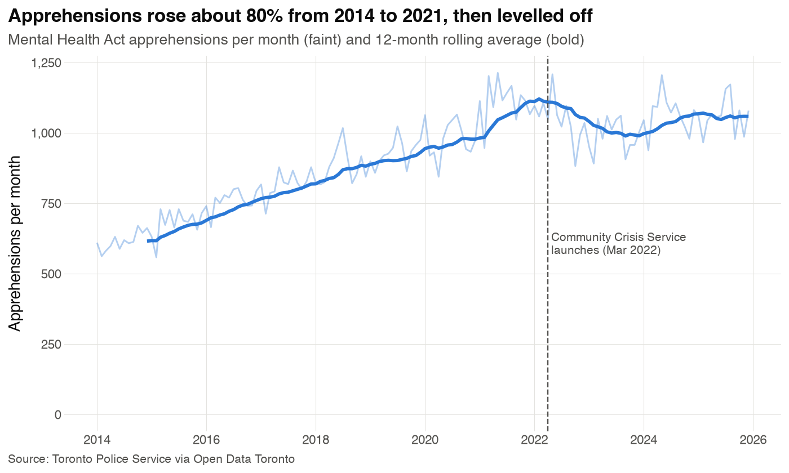
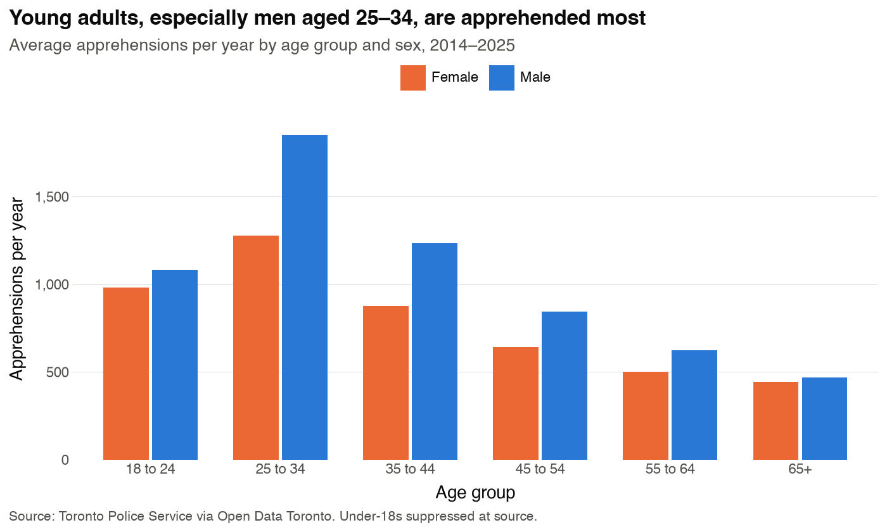
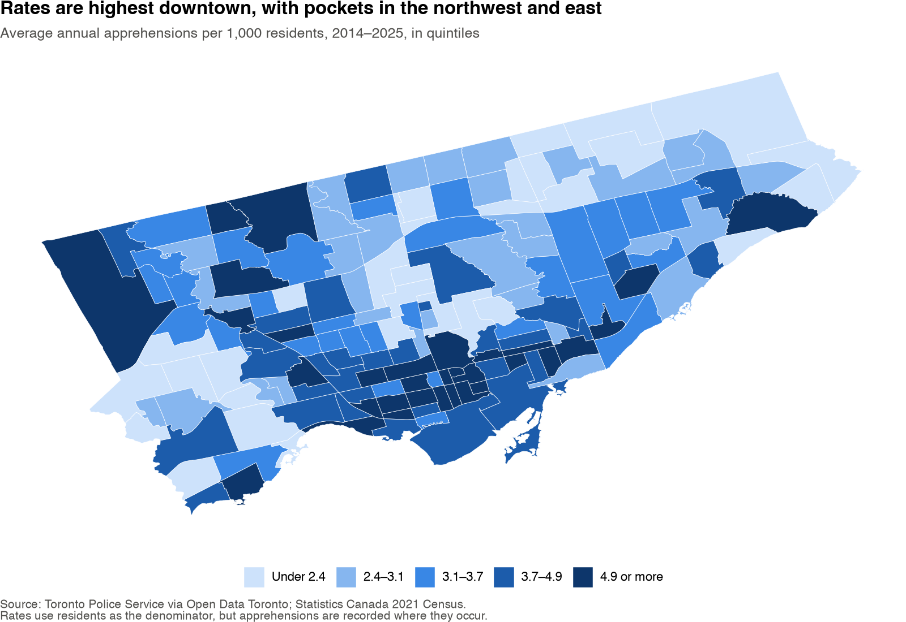
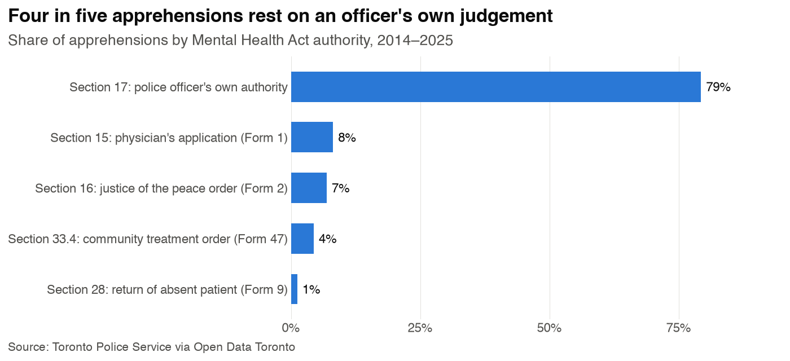
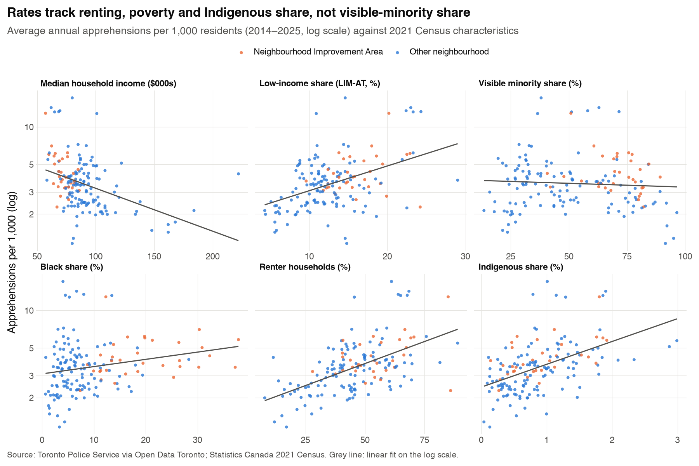
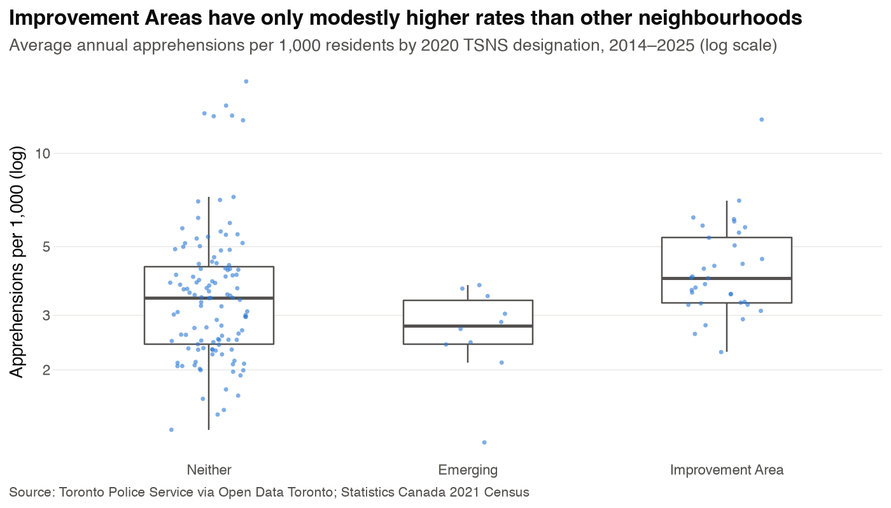

# EDA: Mental Health Act apprehensions

Exploratory analysis of Toronto Police Mental Health Act apprehensions joined to 2021 Census neighbourhood characteristics. Figures and tables in this folder are generated by `scripts/05a-exploratory_data_analysis_apprehensions.py`; numbers cover **2014–2025** unless stated.

The companion analysis of race-based arrests and strip searches is in [`../arrests/eda_arrests.md`](../arrests/eda_arrests.md); the project overview is in [`../../paper_draft.md`](../../paper_draft.md).

---

## 1. The question

When someone in Toronto is in a mental health crisis, police can detain them and take them to hospital under the Ontario *Mental Health Act*. This is called an **apprehension**. We ask: **are apprehensions spread evenly across the city, or concentrated in poorer, renter-heavy and racialized neighbourhoods?**

## 2. The data

We combine three public datasets from Open Data Toronto.

| Dataset | What one row is | Size | What we use it for |
|---|---|---|---|
| Mental Health Act Apprehensions (Toronto Police Service) | One apprehension | 137,607 rows (131,325 after cleaning) | The outcome: who, when, where, under what authority |
| Neighbourhoods (City of Toronto) | One neighbourhood boundary | 158 | Mapping, and the key that links the other two |
| Neighbourhood Profiles, 2021 Census | One census measure × 158 neighbourhoods | 2,604 measures | Population, income, renting, race, NIA status |

### 2.1 Apprehensions

Each row records one person apprehended. After cleaning, these are the fields we keep:

| Field | Example | Notes |
|---|---|---|
| `event_id` | GO-20231030374 | Incident number. One incident can involve 2–3 people, so it is not unique. |
| `occurrence_date`, `occurrence_hour` | 2023-05-08, 20 | When it happened |
| `report_date` | 2023-05-08 | When police logged it (usually the same day) |
| `apprehension_type` | Section 17: police officer's own authority | The legal power used (see §4.2) |
| `premises_type` | Apartment | Apartment 42%, House 18%, Outside 17%, Other 16%, Commercial 5%, Transit 3%, Educational 1% |
| `sex` | Female | Male 56%, Female 44% |
| `age_group` | 18 to 24 | Six bands from 18–24 to 65+ |
| `police_division` | D31 | One of 17 police divisions |
| `hood_id` | 22 | Neighbourhood where it happened (1–174, 158 in use) |

**What it does not contain:**
- **Exact locations.** The finest geography is the neighbourhood, so we can map neighbourhoods but not individual points.
- **Race or ethnicity of the person.** Race can only be studied through who lives in a neighbourhood, not who was apprehended.
- **Anyone under 18.** Youth records are removed by police before publication.
- **A person ID.** Someone apprehended five times appears five times. Counts are apprehensions, not people.

**Cleaning decisions:**
- **Years:** kept 2014–2025 by date of occurrence, dropping 13 stray pre-2014 rows and part-year 2026.
- **Missing values:** "NSA" (not specified) and "Not Recorded" became missing values. That affects neighbourhood (1,438 rows, 1.1%), police division (854), age (1,298) and sex (181).
- **Repeated incident IDs:** all rows are kept. 298 incidents have several rows, mostly different people in the same incident. 115 rows are identical on every field, but with no person ID we can't tell duplicates from lookalikes (<0.1% of rows).

### 2.2 Neighbourhood characteristics (2021 Census)

From the census we take, for each of the 158 neighbourhoods:

| Measure | Median neighbourhood | Range |
|---|---|---|
| Population | 16,955 | 6,260 – 33,300 |
| Median household income | $85,000 | $57,200 – $222,000 |
| Renter households | 46% | 8% – 89% |
| Visible minority share | 51% | 13% – 96% |
| Low-income share (LIM-AT) | 12% | 4% – 29% |
| Black share, Indigenous share | 7%, 0.8% | 0.7–38%, 0.04–3% |
| City designation (TSNS 2020) | — | 33 Improvement Areas, 10 Emerging, 115 neither |

### 2.3 The main outcome: apprehension rate

Big neighbourhoods have more apprehensions simply because more people live there. So we compare **apprehensions per 1,000 residents per year**, averaged over 2014–2025. The median neighbourhood has 3.5. The range runs from 1.2 (Steeles) to 17.1 (University).

> **Important caveat: the denominator problem.** Apprehensions are recorded where they *happen*, but the rate divides by people who *live* there. Downtown neighbourhoods with hospitals, shelters, transit hubs and many visitors (University, Kensington-Chinatown, Moss Park, Yonge-Bay) therefore look extreme. University has only 6,435 residents. Any finding has to hold up with and without the downtown core.

---

## 3. Overview figures

### 3.1 Over time

Annual apprehensions rose from **7,387 in 2014 to 13,350 in 2021** (about +80%), dipped to 11,873 in 2023, and have since settled around 12,700. See §4.1 for the 2022 marker.

### 3.2 Who is apprehended

Apprehensions peak among people aged **25–34**, and men outnumber women in every age group. The gap is widest at 25–44 and nearly closes at 65+.

### 3.3 Where

The darkest neighbourhoods (top fifth, 4.9+ per 1,000) cluster in the **downtown core**, with outlying pockets in the **northwest** (West Humber-Clairville, York University Heights) and **east** (West Hill). The lowest rates are in the north-central and northeast suburbs (Steeles, Milliken, Agincourt North) and affluent central areas (Leaside-Bennington).

---

## 4. Follow-up questions

### 4.1 What is the Community Crisis Service? (Figure 01)

**What it is.** The **Toronto Community Crisis Service (TCCS)** sends trained mental health crisis workers, instead of police, to people in crisis. Calls reach it through 2-1-1, through transfers from 9-1-1, or through community partners. From 9-1-1 it only receives "eligible" calls: crises and well-being checks judged safe for a non-police team. Every other crisis call still gets a police response.

**Timeline.**
- **2020–21:** The city approved the service as part of police reform after the 2020 protests and several deaths of people in crisis during police encounters.
- **31 March 2022:** Pilots launched in the northeast and downtown east, with the northwest and downtown west following by mid-2022. The city deliberately placed the pilots **where Mental Health Act apprehensions and 9-1-1 crisis calls were highest**.
- **2023:** Council voted unanimously to expand it citywide by the end of 2024 as Toronto's **fourth emergency service**, alongside police, fire and paramedics.
- **2026:** The city reports it operates citywide, 24/7.

**What the city's evaluations report.**
- **Calls diverted from police:** in the first year (March 2022 to April 2023), 78% of calls transferred from 9-1-1 were resolved with no police on scene. In 2025 it was 76.7% of 4,482 eligible 9-1-1 calls.
- **Volume:** from March 2022 to May 2026 it received 49,185 calls. 54% came through 2-1-1 and 34% through 9-1-1.
- **Police backup:** crisis teams asked for police on about 2.5% of calls attended.

**What this means for our data.**
- **Scale is limited.** In 2025, 9-1-1 handled 26,861 mental-health calls but transferred only 4,482 eligible ones to the TCCS (about 17%). Meanwhile police still made roughly 12,700 apprehensions. The service handles a slice of crisis calls, not most of them.
- **The trend can't tell us whether it worked.** Apprehensions dipped in 2022–23 after launch, then partly rebounded. But 2021 was also an unusual pandemic peak, and the citywide trend mixes many causes. On its own the dip neither proves nor rules out an effect.
- **A better test is possible.** Because the pilots started in specific areas before going citywide, we could compare neighbourhoods inside the pilot areas with those outside them, before and after 2022 (a *difference-in-differences* design). That needs the pilot boundaries, which aren't in our data yet; it's worth pursuing if we want a causal claim.

### 4.2 Apprehension types (Figure 02)

**What it shows.** The *Mental Health Act* gives police several different legal powers to apprehend someone. The figure shows how often each one is used.

| Authority | Who decides | Share |
|---|---|---|
| **Section 17** | **A police officer, on the spot.** The officer must have reason to believe the person is acting disorderly *and* is likely to seriously harm themselves or others, or can't care for themselves. No doctor or judge is involved beforehand. | **79%** |
| Section 15 (Form 1) | A physician has already examined the person and ordered a psychiatric assessment; police carry it out. | 8% |
| Section 16 (Form 2) | A justice of the peace issued an order, usually after a family member or other person swore to the person's behaviour. | 7% |
| Section 33.4 (Form 47) | The person is on a community treatment order and didn't comply; police return them for assessment. | 4% |
| Section 28 (Form 9) | An involuntary patient left hospital without permission; police bring them back. | 1% |

**What it means for this project.**
- **Most of the time police are the decision-makers, not the delivery service.** In four of five apprehensions, no clinician or court was involved before police acted. Those decisions rest on an officer's judgement in the moment, which is exactly where bias and over-policing concerns arise.
- **The share is not falling.** Section 17's share rose slightly, from 78% in 2014 to 82% in 2025, including after the crisis service launched.
- **Section 17 is the cleanest measure of crisis *policing*.** The other types mostly reflect decisions made by doctors and courts. A sensible model choice is to analyse Section 17 separately, or as the main outcome.

### 4.3 How to read the six-panel scatter plot (Figure 05)

**What each part means:**
- **Each dot is one of the 158 neighbourhoods.** Orange dots are city-designated Improvement Areas; blue are the rest.
- **Each panel asks the same question about a different neighbourhood trait:** "Do neighbourhoods with more of *this* have higher apprehension rates?"
- **Horizontal axis:** the neighbourhood trait from the 2021 Census, e.g. median household income in thousands, or the % of households that rent.
- **Vertical axis:** apprehensions per 1,000 residents per year. It's on a **log scale**, so equal distances mean equal *ratios*: 2→4 is the same gap as 5→10. That stops the handful of extreme downtown neighbourhoods (the dots above 10) from squashing everything else.
- **Grey line:** the overall trend. Sloping up means more of the trait goes with higher rates; sloping down means lower rates; flat means no clear relationship.

**What the panels say.** Here's the strength of each relationship, using rank correlation (Spearman ρ: 0 means none, ±1 means perfect):

| Trait | ρ | Plain reading |
|---|---|---|
| Renter households | **+0.53** | Strong: renter-heavy neighbourhoods have higher rates. The median rate is 2.3 in the least-renting fifth of neighbourhoods vs 4.1 in the most-renting fifth. |
| Indigenous share | **+0.53** | Strong: neighbourhoods with more Indigenous residents have higher rates (median 2.6 vs 4.4, bottom vs top fifth). |
| Median household income | **−0.41** | Moderate: richer neighbourhoods have lower rates (4.4 in the poorest fifth vs 2.3 in the richest). |
| Low-income share | +0.38 | Moderate: the same story from the poverty side. |
| Black share | +0.27 | Weak to moderate positive link. |
| Visible minority share | −0.05 | **No relationship.** The line is flat. |

**What it does and doesn't tell us:**
- **Housing tenure, poverty and Indigenous presence matter more than visible-minority share in general.** Three of the five lowest-rate neighbourhoods in the city (Steeles, Milliken and Agincourt North in Scarborough) are 91–95% visible minority, while the highest rates are in mixed downtown areas. "Visible minority" lumps very different groups together, which likely hides differences between them.
- **These traits overlap.** Poorer neighbourhoods rent more and often have more Indigenous residents, so the six panels are not six separate effects. The model needs to look at them **together** to see which still matters after accounting for the others.
- **These are neighbourhood patterns, not facts about individuals.** A higher rate in neighbourhoods with more Indigenous residents does *not* show that Indigenous people are apprehended more. The data has no race for the person apprehended. Drawing individual conclusions from area data is the *ecological fallacy*; the paper must avoid it.
- **The dots above 10 are mostly downtown** (University, Kensington-Chinatown, Moss Park, Downtown Yonge East, Yonge-Bay, West Queen West, South Parkdale). They are affected by the denominator problem in §2.3.

### 4.4 What the Improvement Area comparison says (Figure 06)

**Background: what the designations are.** Under the **Toronto Strong Neighbourhoods Strategy 2020 (TSNS)**, the city scored every neighbourhood on a **Neighbourhood Equity Index**. It combines economic opportunity, social development, health, participation in decision-making and physical surroundings. Neighbourhoods below the equity benchmark became **Neighbourhood Improvement Areas (NIAs)** and get targeted city investment:
- **Improvement Areas:** 31 were named in 2014. Our data shows 33 because some were split when the city redrew boundaries from 140 to 158 neighbourhoods.
- **Emerging Neighbourhoods:** a smaller group of 10 the city flagged as close to the benchmark.
- **Neither:** everything else.

In short, the designation is the **city's own official label for disadvantage**.

**How to read the chart:**
- **Each dot is a neighbourhood,** grouped by designation. The vertical position is its apprehension rate (log scale, as in Figure 05).
- **The box** covers the middle half of neighbourhoods in that group; **the thick line** inside is the median; **the whiskers** show the typical spread.

**What it says:**
- **Improvement Areas are only a bit higher.** Their median rate is **3.9 per 1,000**, vs **3.4** for "Neither" and **2.8** for Emerging. The boxes overlap heavily, so plenty of non-disadvantaged neighbourhoods have higher rates than plenty of Improvement Areas.
- **The highest-rate neighbourhoods are mostly *not* Improvement Areas.** Six of the seven neighbourhoods above 10 per 1,000 are downtown neighbourhoods labelled "Neither". The only Improvement Area among them is South Parkdale (12.8).
- **Why that matters.** If crisis policing simply tracked the city's own definition of disadvantage, Improvement Areas would stand out clearly. They don't. Apprehensions concentrate in places with specific features (dense rental housing, shelters, hospitals, high foot traffic), not just in neighbourhoods with low equity scores overall. The Equity Index is a broad composite, and as Figure 05 shows, the narrower traits (renting, income, Indigenous share) are more strongly linked to apprehensions.
- **Limitation:** "Emerging" has only 10 neighbourhoods, so its lower median is not reliable.

---

## 5. Implications for the model

1. **Outcome:** yearly apprehension counts per neighbourhood (158 × 12), with population as the exposure. This is a negative binomial regression, which suits overdispersed counts. Consider Section 17 only as the main or a secondary outcome (§4.2).
2. **Predictors:** income or low-income share, renter share, Indigenous share and Black share together, plus the NIA designation. Check how strongly the predictors overlap (collinearity) before interpreting individual coefficients.
3. **Downtown core:** run with and without it, or add a downtown indicator (§2.3).
4. **Crisis service:** add a post-2022 period effect now; a pilot-area difference-in-differences design would be a stronger follow-up (§4.1).
5. **Framing:** neighbourhood-level (ecological) associations only; no claims about individuals.

---

## Sources

- Toronto Police Service, *Mental Health Act Apprehensions*; City of Toronto, *Neighbourhoods* and *Neighbourhood Profiles (2021 Census)*, via [Open Data Toronto](https://open.toronto.ca/).
- City of Toronto, [Four community partners announced for the Community Crisis Support Service pilot](https://www.toronto.ca/news/city-of-toronto-announces-four-community-partners-as-part-of-the-launch-of-the-community-crisis-support-service-pilot/).
- City of Toronto, [Executive Committee adopts plan to expand TCCS citywide after successful first year](https://www.toronto.ca/news/city-of-toronto-executive-committee-adopts-plan-to-expand-toronto-community-crisis-service-citywide-after-successful-first-year/); CBC, [Council votes unanimously to expand community crisis service](https://www.cbc.ca/news/canada/toronto/community-crisis-toronto-citywide-1.7023744).
- City of Toronto, [TCCS 1-Year Outcome Evaluation Report](https://www.toronto.ca/wp-content/uploads/2023/10/97b8-Toronto-Community-Crisis-Service-1-Year-Outcome-Evaluation-Report.pdf) (with CAMH).
- City of Toronto, [Advancing the Toronto Community Crisis Service](https://www.toronto.ca/legdocs/mmis/2026/ex/bgrd/backgroundfile-289503.pdf) (2026 report for action).
- City of Toronto, [TSNS 2020 Neighbourhood Equity Index methodology](https://www.toronto.ca/wp-content/uploads/2017/11/97eb-TSNS-2020-NEI-equity-index-methodology-research-report-backgroundfile-67350.pdf) and [Neighbourhood Improvement Area profiles](https://www.toronto.ca/city-government/data-research-maps/neighbourhoods-communities/neighbourhood-profiles/nia-profiles/).
- *Mental Health Act*, R.S.O. 1990, c. M.7, [ss. 15–17, 28, 33.4](https://www.ontario.ca/laws/statute/90m07).
