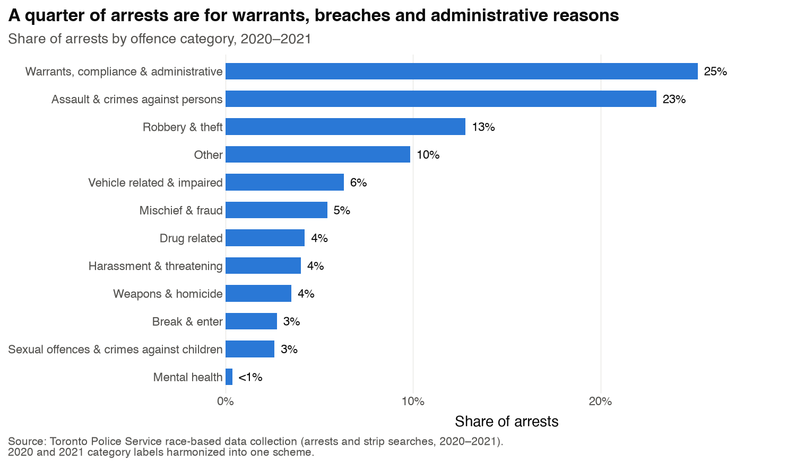
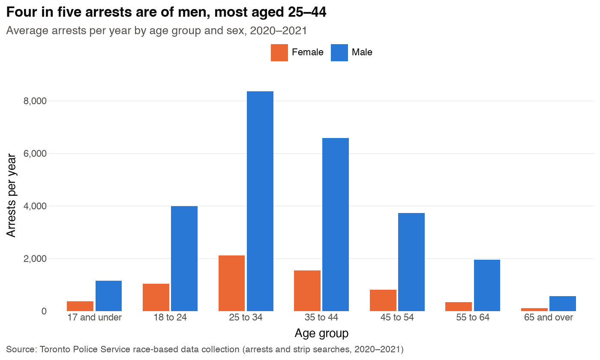
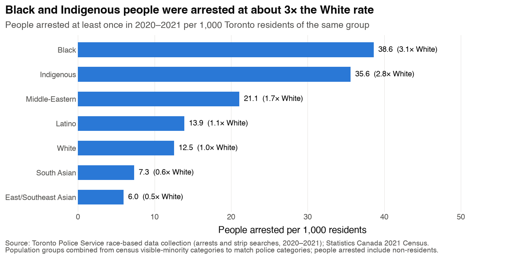
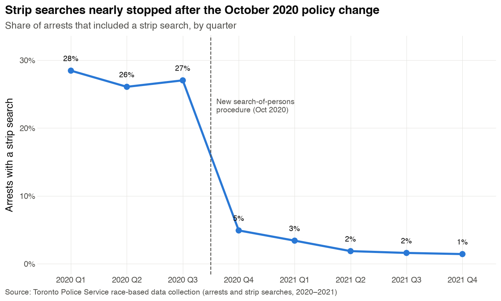
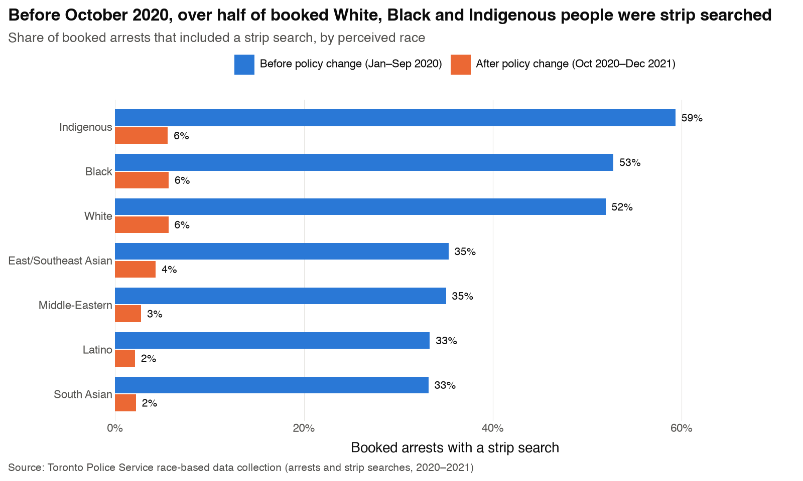
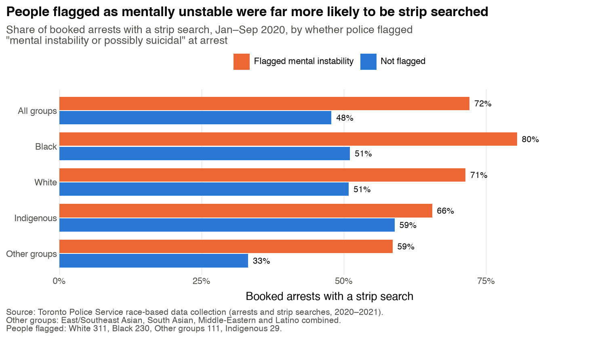
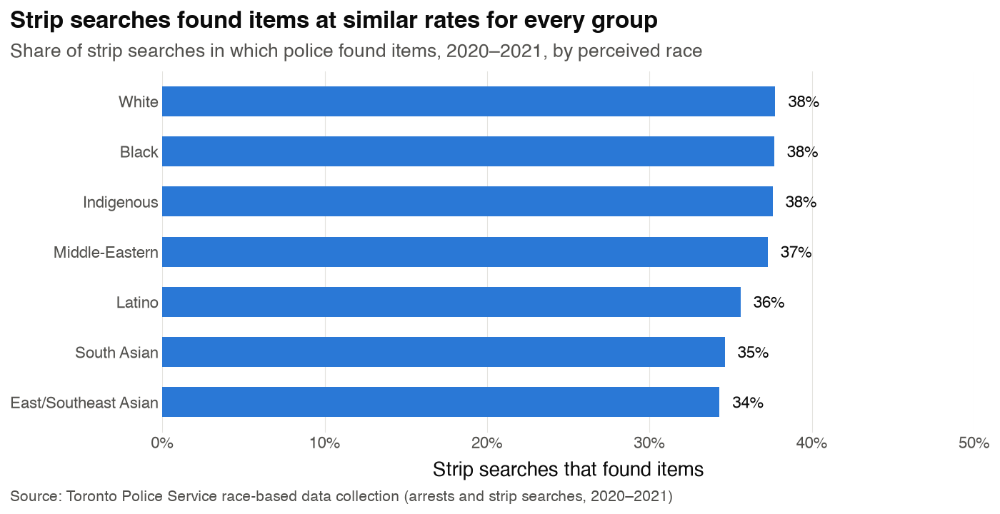

# EDA: race-based arrests and strip searches

Exploratory analysis of the Toronto Police Service's **Race & Identity-Based Data Collection: Arrests and Strip Searches**, benchmarked against the 2021 Census. Figures and tables in this folder are generated by `scripts/05b-exploratory_data_analysis_arrests.py`; numbers cover **2020–2021**.

The main analysis of Mental Health Act apprehensions is in [`../apprehensions/eda_apprehensions.md`](../apprehensions/eda_apprehensions.md); the project overview is in [`../../paper_draft.md`](../../paper_draft.md).

---

## 1. Why this dataset

The apprehensions data has no race for the person apprehended, so it can only show **neighbourhood** patterns. This dataset records the race police **perceived** for each person they arrested. That gives individual-level evidence on two questions:

1. **Who do police arrest, relative to their share of Toronto's population?**
2. **When someone shows signs of a mental health crisis at arrest, are they treated more harshly, and does that differ by race?**

## 2. The data

### 2.1 What one row is

**One row per person arrested** (or strip searched) in 2020–2021: **65,276 records for 37,347 people**.

| Field | What it records |
|---|---|
| `perceived_race` | The race the **officer perceived**, not how the person self-identifies. Black, East/Southeast Asian, Indigenous, Latino, Middle-Eastern, South Asian, White, or Unknown or Legacy (7.7%). |
| `sex`, `age_group`, `youth` | Demographics at arrest. Male 81%, female 19%; youth (17 and under) 4.7%. |
| `year`, `quarter` | When it happened. Quarters only, no exact dates. 31,979 in 2020 and 33,297 in 2021. |
| `offence_category` | What the arrest was for, in 12 groups (§3.1) |
| `booked` | Whether the person was booked at a station (53%) |
| `strip_searched` | Whether they were strip searched (12% overall) |
| Arrest flags | What the officer recorded about the person's behaviour: cooperative (45%), combative (4.4%), resisted (3.8%), **mental instability or possibly suicidal (3.3%)**, assaulted officer (0.6%), concealed items (0.4%) |
| Search fields | Strip searches only: the reasons (risk of injury, escape, weapons, evidence) and whether items were found |

**Repeat arrests.** 72% of people were arrested only once in the two years. But **2,143 people were arrested five or more times, and they account for 27% of all arrests** (one person was arrested 54 times). That's why the race comparison in §4.1 counts *people*, not arrests.

### 2.2 Data quality and cleaning

- **The Open Data Toronto copy is truncated.** The city portal's CSV and JSON stop at exactly **32,000 rows**. The police service's own source ([ArcGIS layer `RBDC_ARR_TBL_001`](https://services.arcgis.com/S9th0jAJ7bqgIRjw/ArcGIS/rest/services/RBDC_ARR_TBL_001/FeatureServer)) has **65,276**. We download from the police source, and a test checks the full count. Analysing the city copy would silently use about half the data.
- **Labels changed between 2020 and 2021.** Offence categories ("Robbery & Theft" vs "Robbery/Theft"; warrants moved into "Administrative"), age groups ("17 and under" vs "17 and younger") and youth labels all differ by year. We merged them into one consistent scheme.
- **Location is mostly missing.** 45% of arrests are coded "XX" (outside Toronto or not geocoded), so we don't analyse geography.
- **Bookings:** 572 strip searches had no booking recorded. As the police documentation instructs, we count them as booked.
- **Missing arrest IDs:** 469 records (all strip searches without a booking) have no arrest ID. They are kept.
- **Missing values:** race 4 records, sex 9, age 24, offence 165.

### 2.3 Population benchmark

Comparing groups fairly requires each group's share of Toronto's population. We built this from the 2021 Census (25% sample, private households) by combining census groups to match the police categories:

| Police category | Census groups combined | Population | Share |
|---|---|---|---|
| White | Not a visible minority, minus Indigenous identity | 1,201,120 | 43.5% |
| East/Southeast Asian | Chinese, Filipino, Southeast Asian, Korean, Japanese | 575,780 | 20.9% |
| South Asian | South Asian | 385,435 | 14.0% |
| Black | Black | 264,990 | 9.6% |
| Middle-Eastern | Arab, West Asian | 111,365 | 4.0% |
| Latino | Latin American | 92,445 | 3.3% |
| Indigenous | Indigenous identity | 22,915 | 0.8% |

The remaining 4% of residents gave "multiple" or "not included elsewhere" visible-minority responses, which have no matching police category.

---

## 3. Overview figures

### 3.1 What people are arrested for

- **The largest category isn't a new crime.** A quarter of arrests (25%) are for **warrants, failing to appear or comply with conditions, and administrative reasons**: arrests that come from existing court or police processes.
- **Next** come assault and other crimes against persons (23%), and robbery and theft (13%).
- **"Mental health"** as the *offence category* is rare (239 arrests, under 1%). Mental health shows up much more through the **arrest flag**: 2,179 arrests (3.3%) were flagged "mental instability or possibly suicidal" across all offence types. Of the "Mental health" category arrests, 18% carried that flag.

### 3.2 Who is arrested

- **Four in five arrests are of men**, in every age group.
- **Arrests peak at ages 25–34** (about 8,400 men and 2,100 women a year), followed by 35–44.
- This differs from apprehensions, where women made up 44% and the peak was the same age band but with a much smaller sex gap.

---

## 4. Race and policing

### 4.1 Arrest rates relative to population

**How to read it:** for each group, the number of *different people* arrested at least once in 2020–21 per 1,000 Toronto residents in that group. The label shows the rate and how it compares with the White rate.

**What it shows:**

| Perceived race | People arrested | Per 1,000 residents | vs White |
|---|---|---|---|
| Black | 10,236 | 38.6 | **3.1×** |
| Indigenous | 816 | 35.6 | **2.8×** |
| Middle-Eastern | 2,347 | 21.1 | 1.7× |
| Latino | 1,284 | 13.9 | 1.1× |
| White | 15,073 | 12.5 | 1.0× |
| South Asian | 2,831 | 7.3 | 0.6× |
| East/Southeast Asian | 3,428 | 6.0 | 0.5× |

This is the largest disparity in the data, and it appears at the **first stage of contact**, before any search decision.

**Caveats:**
- Some people arrested don't live in Toronto, while the denominator counts only residents.
- Race is the officer's perception.
- Census and police categories don't line up perfectly.
- Arrest rates reflect where police are deployed and what they're called to, not only how individuals behave.
- 7.7% of records are "Unknown or Legacy" and excluded from this comparison.

### 4.2 The October 2020 strip search policy change

**Before October 2020, more than a quarter of all arrests (26–28%) included a strip search.** Toronto Police then overhauled their search-of-persons procedure, after criticism that they strip searched far more than other Ontario police services. The new procedure brought in staged searches, the right to counsel before a strip search, and supervisor approval. Strip searches fell to **5%** the next quarter and to about **1%** by late 2021.

**Why this matters:** any comparison of strip search rates must be made **within** a period. Otherwise the figures mostly reflect when someone was arrested. All the race comparisons below split before and after.

### 4.3 Strip searches by race

**How to read it:** the share of **booked** arrests that included a strip search. We count only booked people because strip searches happen during booking. Blue bars are before the policy change, orange bars after.

**What it shows:**
- **Before the change,** more than half of booked Indigenous (59%), Black (53%) and White (52%) people were strip searched. East/Southeast Asian, Middle-Eastern, Latino and South Asian people were searched at about a third (33–35%).
- **After the change,** rates fell to 2–6% for every group, and the gaps between groups shrank.
- **Black and White people were searched at almost the same rate once booked.** So in this data, the big Black–White gap is at the **arrest** stage (§4.1), not the search stage. Indigenous people had the highest search rate before the change.

### 4.4 Mental instability and strip searches

This is the link back to the main project. Officers can flag that a person showed **"mental instability or possibly suicidal"** behaviour at arrest. That happened in 2,179 arrests (3.3%).

**How to read it:** before the policy change (Jan–Sep 2020), the share of booked people who were strip searched. Orange bars are people the officer flagged; blue bars are everyone else. The smaller groups are combined as "Other groups" to keep numbers large enough.

**What it shows:**
- **People flagged as mentally unstable were strip searched far more often:** 72% vs 48% overall.
- **The gap is largest for Black people:** 80% of those flagged were strip searched, vs 71% of flagged White people. Among people who weren't flagged, the two groups were identical (51%).
- **Other groups** show the biggest jump in relative terms (33% unflagged to 59% flagged).
- **Indigenous people** have a smaller gap (66% vs 59%), but only 29 flagged Indigenous people were booked in this period, so that figure is unreliable.

**Why it matters:** people in mental health crisis were subjected to the most invasive search procedure much more often. The extra penalty appears larger for Black people. This fits the concern that crisis behaviour is read as a threat, and read more harshly for some groups. With only 230 flagged Black people and 311 flagged White people, it should be treated as suggestive, not definitive.

### 4.5 What strip searches found

**How to read it:** of all strip searches, the share in which police found items such as drugs, weapons or evidence.

**What it shows:** items were found in **34–38% of searches for every group**. Black, White and Indigenous people had identical rates (38%).

**Why it matters:** this is an **"outcome test"**. If police searched one group on weaker grounds, searches of that group would find things *less* often. Here the find rates are nearly equal, so this data shows no evidence of a lower search threshold for any group. It also means **about 62% of strip searches found nothing.**

---

## 5. How this fits with the apprehensions analysis

| | Apprehensions (main) | Arrests (supplementary) |
|---|---|---|
| Event | Mental Health Act apprehension | Criminal or administrative arrest |
| Years | 2014–2025 | 2020–2021 |
| Race | Neighbourhood level only (census) | Individual level (officer-perceived) |
| Mental health link | Every row | Only the 3.3% flagged "mental instability" |
| Geography | 158 neighbourhoods | Mostly unknown |

**Taken together:**
- **The apprehensions analysis shows *where* crisis policing concentrates.** Rates are highest downtown and track renting, poverty and Indigenous share.
- **This dataset shows *who* police arrest and search.** Black and Indigenous people are arrested at about 3× the White rate. People in mental health crisis face much higher strip search rates, especially Black people.
- **Use it as supporting evidence.** The two datasets can't be linked record by record, so this one supports the main analysis about individual-level disparities rather than replacing it.

---

## Sources

- Toronto Police Service, *Race & Identity-Based Data Collection: Arrests and Strip Searches* ([TPS ArcGIS source](https://services.arcgis.com/S9th0jAJ7bqgIRjw/ArcGIS/rest/services/RBDC_ARR_TBL_001/FeatureServer); [Open Data Toronto listing](https://open.toronto.ca/dataset/police-race-and-identity-based-data-collection-arrests-strip-searches/), truncated at 32,000 rows).
- City of Toronto, *Neighbourhood Profiles (2021 Census)*, via [Open Data Toronto](https://open.toronto.ca/).
- Toronto Police Service, [RBDC Frequently Asked Questions](https://www.tps.ca/race-identity-based-data-collection/rbdc-frequently-asked-questions/).
- CBC, ['We do not accept your apology': Toronto police race-based data release](https://www.cbc.ca/news/canada/toronto/toronto-police-race-based-data-use-force-strip-searches-1.6489151).
- NOW Toronto, [Flaws exposed in Toronto police's new policy on strip searches](https://nowtoronto.com/news/toronto-police-new-policy-on-strip-searches/).
